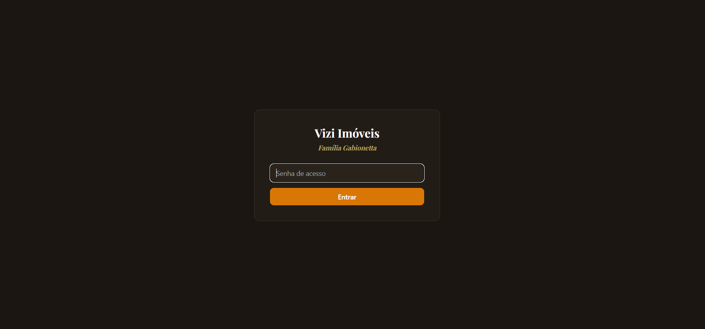
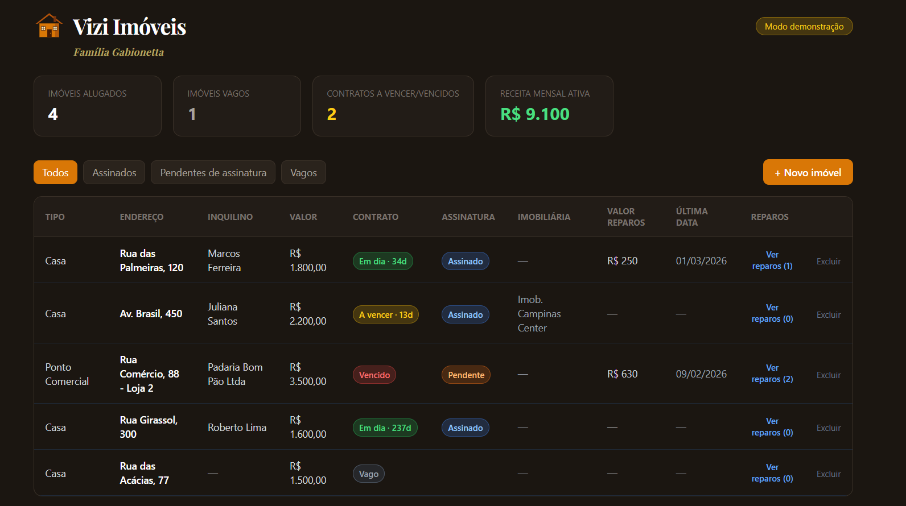
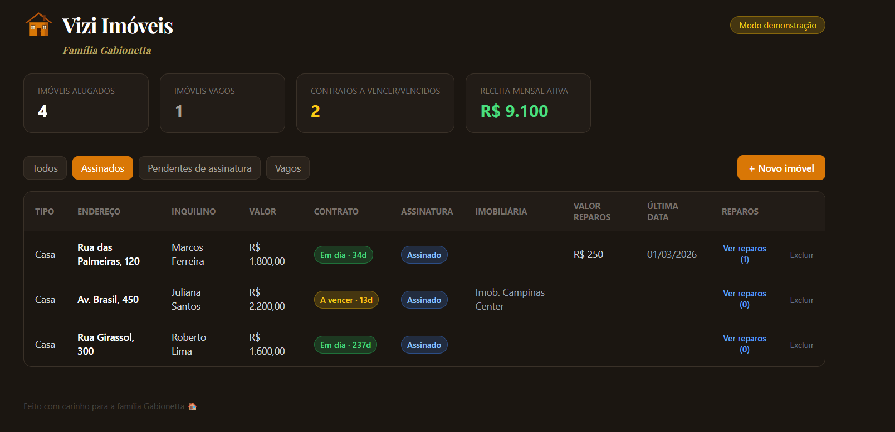
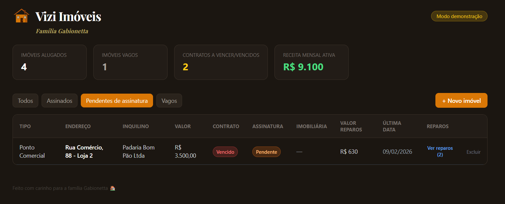
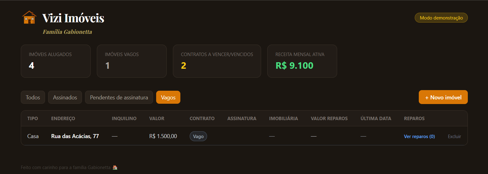
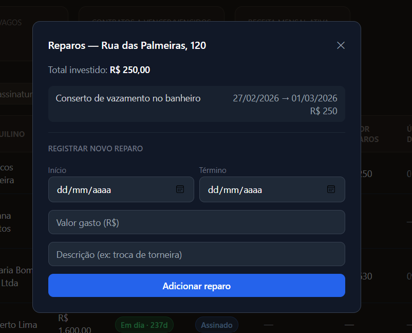
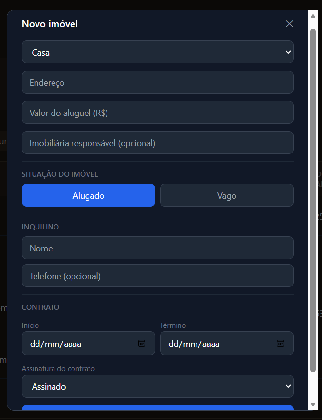

# 🏠 Vizi Imóveis

Sistema completo de gestão de imóveis para aluguel, desenvolvido para controle de inquilinos, contratos e manutenções. Criado para uso real de administração de imóveis de uma família, com foco em simplicidade visual e automação de status.

## 🔗 Demonstração

**Acesse:** https://gabionetta-imoveis.vercel.app/
**Senha de acesso:** `gabionetta2026`

> ⚠️ **Atenção: este é um ambiente 100% de demonstração.** Todos os imóveis, inquilinos, valores e contratos exibidos são fictícios, gerados apenas para fins de teste e apresentação do projeto. Nenhuma informação real está armazenada ou exposta aqui.

## 📸 Screenshots

### Tela de login


### Dashboard


### Filtro — Assinados


### Filtro — Pendentes de assinatura


### Filtro — Vagos


### Histórico de reparos


### Cadastro de novo imóvel


## 💡 Sobre o projeto

O Vizi Imóveis resolve um problema comum de quem administra imóveis alugados de forma independente (sem imobiliária, ou com controle misto): saber rapidamente quais contratos estão em dia, quais estão vencendo, quais imóveis estão vagos, e ter um histórico organizado de reparos e custos de manutenção — tudo isso sem depender de planilhas soltas.

## ⚙️ Funcionalidades

- **Cadastro de imóveis**: casa ou ponto comercial, podendo ficar vagos ou alugados
- **Status automático do contrato**: 🟢 Em dia · 🟡 A vencer (≤30 dias) · 🔴 Vencido — calculado automaticamente pela data de vencimento, sem necessidade de atualização manual
- **Status de assinatura**: Assinado / Pendente de assinatura
- **Filtros por aba**: Todos, Assinados, Pendentes, Vagos
- **Histórico de reparos**: registro por imóvel com data, valor e descrição de cada manutenção
- **Imobiliária responsável**: campo opcional para imóveis administrados por terceiros
- **Dashboard de métricas**: total de imóveis alugados, vagos, contratos a vencer/vencidos e receita mensal ativa consolidada
- **Proteção por senha de acesso**: tela de login simples antes de liberar o sistema
- **Modo demonstração automático**: roda com dados fictícios, sem precisar configurar banco de dados
- **Sincronização em tempo real**: via Supabase Realtime, quando conectado a um banco de dados real

## 🛠️ Tecnologias utilizadas

- **JavaScript (React)** — biblioteca principal para construção da interface, com componentização (Hooks como `useState`, `useMemo`) e gerenciamento de estado local
- **Tailwind CSS** — estilização utilitária, responsável por todo o visual customizado (tema escuro, cores de status, responsividade)
- **Supabase** — backend as a service, usado como banco de dados (PostgreSQL) e para sincronização em tempo real (Realtime)
- **SQL** — script de criação de tabelas (`supabase_setup.sql`) para estruturar o banco de dados no Supabase
- **Vercel** — plataforma de deploy e hospedagem do projeto

## 🚀 Como rodar localmente

```bash
npm install
npm start
```

Sem configurar nada, o app já roda em **modo demonstração**, com dados fictícios — é possível usar e testar tudo sem precisar de banco de dados.

## 🔐 Variáveis de ambiente

Copie o arquivo `.env.example` para `.env` e preencha:
> Se as variáveis do Supabase não forem preenchidas, o app cai automaticamente em modo demonstração, com dados fictícios.

## 🗄️ Como conectar ao Supabase (dados reais e permanentes)

1. Crie uma conta gratuita em [supabase.com](https://supabase.com)
2. Crie um novo projeto
3. Vá em **SQL Editor** → New query → cole o conteúdo do arquivo `supabase_setup.sql` deste repositório → Run
4. Vá em **Project Settings > API** e copie a **URL** e a **anon public key**
5. Preencha o `.env` conforme acima
6. Reinicie o app (`npm start`)

## ☁️ Deploy (Vercel)

```bash
npm install -g vercel
vercel login
vercel
vercel --prod
```

Configure as mesmas variáveis de ambiente em **Project Settings → Environment Variables** na Vercel.

## 🗺️ Roadmap futuro

- Autenticação multiusuário (para eventualmente atender mais de um dono de imóveis)
- Notificação automática (email/WhatsApp) quando contrato entra em "a vencer"
- Anexo de documentos do contrato

---

Desenvolvido com carinho para a família Gabionetta 🏠 · Este é um projeto de demonstração — dados fictícios.